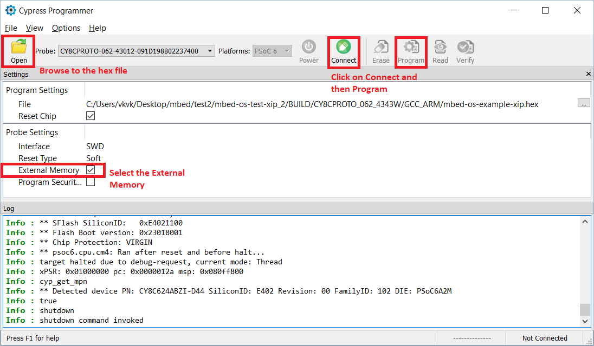

# Overview
This example demonstrates the Execute-In-Place (XIP) feature of PSoC 6 MCU using the SMIF block. In this example, a function is placed and executed from external QSPI memory. The function increments a set of integers and then prints on to a UART terminal.

# Operation

1. Run the following commands to fetch the project:

  ```
	mbed import https://github.com/cypresssemiconductorco/mbed-os-example-xip
    cd mbed-os-example-xip
  ```
2. Compile the project. The below command compiles with target as CY8CPROTO_062_4343W and tool chain as GCC_ARM

  ```
	mbed compile -m CY8CPROTO_062_4343W -t GCC_ARM
  ```
3. Programming  

	Since programming the external memory is currently not supported by DAPLink, a programming tool such as [Cypress Programmer](https://www.cypress.com/products/psoc-programming-solutions) is required for this example.
	Below steps shows programming using Cypress Programmer:  
	
	 **a**. Switch from **DAPLink** mode to **KitProg** mode.  
		For single-button kits (CY8CPROTO_062_4343W) press button SW3 (MODE) for more than 2 seconds and release.  
		For two-button kits (CY8CKIT_062_BLE and CY8CKIT_062_WIFI_BT) press and release button SW4 (CUSTOM APP).  
	 
	 **b**. From Cypress Programmer, browse to the hex file location:  
	 
			..\BUILD\CY8CPROTO_062_4343W\GCC_ARM\mbed-os-example-xip.hex  
			
	 **c**. In the Probe Settings, check the **External Memory** so as to enable external memory programming.  
	 
	 **d**. Click on the **Connect** button and then click **Program**.  
	 
	   
	 
4. Enter the following command to connect to the UART terminal.

  ```
	mbed sterm -p <COM_PORT>
	
	For example, if your Kit COM port is COM100 then,
	mbed sterm -p com100
  ```  
# Expected Output

UART terminal displays the following message

  ```
	----- Mbed OS Execute-In-Place (XIP) Example -----

	Success: QSPI in XIP mode
	Local data before XIP manipulation:
	Data Buffer: 00 01 02 03 04 05 06 07 08 09 0A 0B 0C 0D 0E 0F 10 11 12 13 14 15 16 17 18 19 1A 1B 1C 1D 1E 1F
	Executing from external flash
	Local data after XIP manipulation:
	Data Buffer: 01 02 03 04 05 06 07 08 09 0A 0B 0C 0D 0E 0F 10 11 12 13 14 15 16 17 18 19 1A 1B 1C 1D 1E 1F 20
  ``` 
The LED1 (Red LED) on the kit blinks every 1s.

# Release Notes
| Version | Description                                 |
| ------- | --------------------------------------------|
| 1.0     |Initial release. Tested with mbed-os v5.12   |
| 1.10     |Updated to Mbed OS v5.13.0. **Note:** This example does not work with  Mbed OS v5.13.1. This will be addressed in future updates.   |
